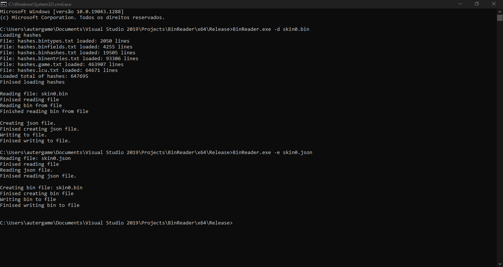

# BinReader
League Of Legends Bin Reader And Writter

## Help From:
* https://github.com/moonshadow565/ritobin
* https://github.com/LoL-Fantome/LeagueToolkit
* https://github.com/CommunityDragon/CDTB
* https://github.com/DaveGamble/cJSON

## How to use: 

decode bin to json:
```
BinReader.exe -d skin0.bin
```

encode json to bin: 
```
BinReader.exe -e skin0.json
```


